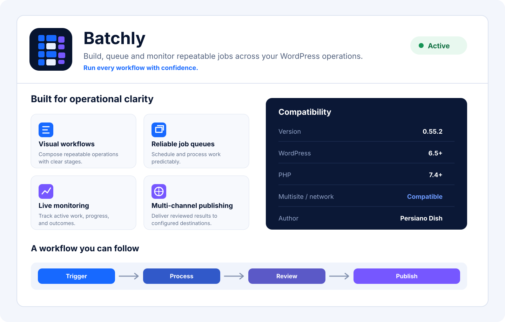

  

# Batchly

**Orders, customers, production, correspondence and publishing in one configurable WordPress workspace.**

Batchly is a modular business-operations platform created by **Persiano Dish** for independent food businesses, bakeries, caterers, meal-prep businesses and other small product-based operations.

> **Your business, organized.**

## Current platform release

| Package | Current version |
| --- | ---: |
| **Batchly Core plugin** | **0.56.5** |
| **Theme API** | **1.0** |
| WordPress | 6.5 or newer |
| PHP | 7.4 or newer |

Storefront themes are separate products. Persiano Dish, Velvet Crumbs and future clients may each use a different Batchly-compatible theme with its own design, version and update channel.

## Platform model

- **Batchly Core** owns business operations, integrations and the stable theme-facing API.
- **Commerce adapters** connect Batchly to commerce systems. WooCommerce is the current adapter for the existing product, cart, checkout and order workflows.
- **Storefront themes** are independently customizable and can be standard, client-specific or fully custom.
- Themes should use the documented Batchly helpers, hooks and REST endpoints rather than internal tables or legacy Persiano-specific options.

## Main capabilities

- Business Setup Wizard and reusable business profiles
- Products, customers and manual orders
- Secure payment-link workflows
- Order-based email and SMS correspondence
- Square transaction synchronization
- Recipes, costing, production and fulfilment tools
- Food labels, Avery sheets, barcodes and QR codes
- Publishing and external-channel connections
- Trial monitoring and tester feedback
- Shared Core updates while each site keeps its own data, branding, theme and credentials

## Latest release — 0.56.5
    
- Removes the obsolete theme updater card from Batchly Core.
- Clarifies that client storefront themes are optional and independently released.
- Preserves the corrected GitHub ZIP download handling from 0.56.4.
- Provides the first complete GitHub → WordPress automatic-update test.

## Installation

1. Open the repository's [Releases page](https://github.com/pooyadehdashti-oss/persiano-releases/releases).
2. Download the latest `batchly-vX.Y.Z.zip` Core package.
3. In WordPress, open **Plugins → Add New Plugin → Upload Plugin**.
4. Upload, install and activate Batchly Core.
5. Install any compatible storefront theme separately under **Appearance → Themes**.

Existing Batchly and former Persiano Hub installations retain their existing products, customers, orders, correspondence, settings and third-party credentials during normal upgrades.

## Theme compatibility

Batchly Core 0.56.3 exposes Theme API 1.0, including:

- `batchly_get_business_profile()`
- `batchly_get_theme_api_version()`
- `batchly_get_commerce_adapter()`
- `batchly_theme_is_compatible()`
- `batchly_theme_api_ready` action
- `batchly_business_profile` and `batchly_commerce_adapter` filters
- `/wp-json/batchly/v1/business-profile`
- `/wp-json/batchly/v1/compatibility`

## Release publishing

The Core release workflow validates and publishes `batchly-vX.Y.Z.zip`. Theme packages should use separate repositories or release workflows so client themes can evolve independently.

## Release history

See [`docs/RELEASES.md`](docs/RELEASES.md) for the maintained release summary and [`latest.json`](latest.json) for machine-readable Core metadata.

## Product preview

  

## Author

Batchly is created and maintained by **Persiano Dish**.
